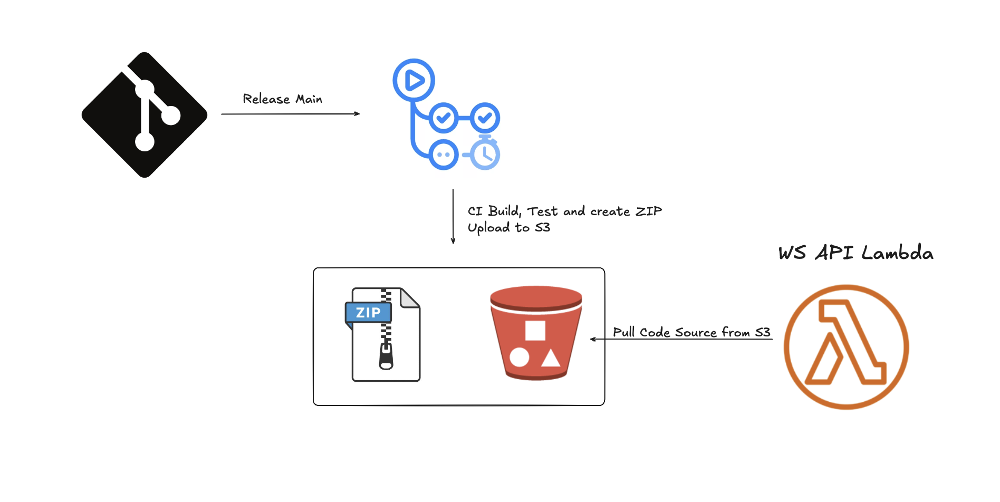
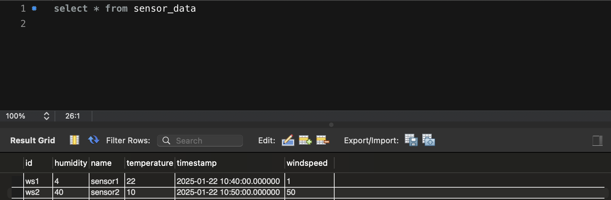

# Project: WeatherStation Docs
This is a REST API Documentation for the Weather Station project.

The first part is the basic CRUD operations and the second part is the more interesting query operation.

The application is built with springboot using the aws maven archetype so that it is built to run as an AWS Lambda function.

The API gateway handles the requests and forwards them to the lambda function.

Here is a simple architecture diagram:


The full solution is not complete as you can see the way I designed the solution was to have 2 microservices the sensor controller/abstraction layer and the WS_API because not all sensors can post data directly to my API endpoint their data needs to be parsed into the correct format and then posted to the WS_API application.


The Project Continous Development was designed and intended to work in the following way:



SO far in this project only the first half of the work gets done. The CI runs the command:

```bash
mvn clean install
```
That already runs some simple tests and builds the project.

The second half of the work is not done yet but it would be to deploy the application to AWS Lambda
by configuring the lambda to take its source code from the AWS S3 bucket.

AWS RDS database was a good choice for this project as it offers structured storing of data and ease of querying the database.




### Some Future Improvements 🚀:
* Set up the CI/CD pipeline to deploy the application to AWS Lambda
* Add more tests to the application
* Make the sensor controller microservice and pull data form available sensors throught their custom API.
* Set up an elasicache cluster on AWS for RDS.


# REST API Documentation


# 📁 Collection: CRUD 
In this section you can see an example of Create, Read, Update and Delete operations on the sensors data. 


## End-point: all_sensors
### Method: GET
>```
>https://l88p72xj85.execute-api.eu-west-1.amazonaws.com/dev/weatherStation/
>```
### 🔑 Authentication noauth

|Param|value|Type|
|---|---|---|


### Response: 200
```json
[
    {
        "id": "ws1",
        "timestamp": 1737542400000,
        "name": "sensor1",
        "temperature": 22,
        "humidity": 4,
        "windspeed": 1
    },
    {
        "id": "ws2",
        "timestamp": 1737543000000,
        "name": "sensor2",
        "temperature": 10,
        "humidity": 40,
        "windspeed": 50
    }
]
```


⁃ ⁃ ⁃ ⁃ ⁃ ⁃ ⁃ ⁃ ⁃ ⁃ ⁃ ⁃ ⁃ ⁃ ⁃ ⁃ ⁃ ⁃ ⁃ ⁃ ⁃ ⁃ ⁃ ⁃ ⁃ ⁃ ⁃ ⁃ ⁃ ⁃ ⁃ ⁃ ⁃ ⁃ ⁃ ⁃ ⁃ ⁃ ⁃ ⁃ ⁃ ⁃ ⁃ ⁃ ⁃ ⁃ ⁃

## End-point: sensor-by-id
### Method: GET
>```
>https://l88p72xj85.execute-api.eu-west-1.amazonaws.com/dev/weatherStation/ws1
>```
### Response: 200
```json
{
    "id": "ws1",
    "timestamp": 1737542400000,
    "name": "sensor1",
    "temperature": 22,
    "humidity": 4,
    "windspeed": 1
}
```


⁃ ⁃ ⁃ ⁃ ⁃ ⁃ ⁃ ⁃ ⁃ ⁃ ⁃ ⁃ ⁃ ⁃ ⁃ ⁃ ⁃ ⁃ ⁃ ⁃ ⁃ ⁃ ⁃ ⁃ ⁃ ⁃ ⁃ ⁃ ⁃ ⁃ ⁃ ⁃ ⁃ ⁃ ⁃ ⁃ ⁃ ⁃ ⁃ ⁃ ⁃ ⁃ ⁃ ⁃ ⁃ ⁃ ⁃

## End-point: add-sensor-data
### Method: POST
>```
>https://l88p72xj85.execute-api.eu-west-1.amazonaws.com/dev/weatherStation/
>```
### Body (**raw**)

```json
{
    "id":"ws3",
    "timestamp":"2025-01-22T11:50:00Z",
    "name":"sensor2",
    "temperature":2,
    "humidity":11,
    "windspeed":1
}

```

### Response: 201
```json
{
    "id": "ws3",
    "timestamp": 1737546600000,
    "name": "sensor2",
    "temperature": 2,
    "humidity": 11,
    "windspeed": 1
}
```


⁃ ⁃ ⁃ ⁃ ⁃ ⁃ ⁃ ⁃ ⁃ ⁃ ⁃ ⁃ ⁃ ⁃ ⁃ ⁃ ⁃ ⁃ ⁃ ⁃ ⁃ ⁃ ⁃ ⁃ ⁃ ⁃ ⁃ ⁃ ⁃ ⁃ ⁃ ⁃ ⁃ ⁃ ⁃ ⁃ ⁃ ⁃ ⁃ ⁃ ⁃ ⁃ ⁃ ⁃ ⁃ ⁃ ⁃

## End-point: update-sensor-data
### Method: PUT
>```
>https://l88p72xj85.execute-api.eu-west-1.amazonaws.com/dev/weatherStation/ws3
>```
### Body (**raw**)

```json
{
    "id":"ws3",
    "timestamp":"2025-01-22T11:50:00Z",
    "name":"sensor2",
    "temperature":10,
    "humidity":11,
    "windspeed":1
}

```

### Response: 200
```json
{
    "id": "ws3",
    "timestamp": 1737546600000,
    "name": "sensor2",
    "temperature": 10,
    "humidity": 11,
    "windspeed": 1
}
```


⁃ ⁃ ⁃ ⁃ ⁃ ⁃ ⁃ ⁃ ⁃ ⁃ ⁃ ⁃ ⁃ ⁃ ⁃ ⁃ ⁃ ⁃ ⁃ ⁃ ⁃ ⁃ ⁃ ⁃ ⁃ ⁃ ⁃ ⁃ ⁃ ⁃ ⁃ ⁃ ⁃ ⁃ ⁃ ⁃ ⁃ ⁃ ⁃ ⁃ ⁃ ⁃ ⁃ ⁃ ⁃ ⁃ ⁃

## End-point: New Request
### Method: DELETE
>```
>https://l88p72xj85.execute-api.eu-west-1.amazonaws.com/dev/weatherStation/ws3
>```
### Response: 204
```json
null
```


⁃ ⁃ ⁃ ⁃ ⁃ ⁃ ⁃ ⁃ ⁃ ⁃ ⁃ ⁃ ⁃ ⁃ ⁃ ⁃ ⁃ ⁃ ⁃ ⁃ ⁃ ⁃ ⁃ ⁃ ⁃ ⁃ ⁃ ⁃ ⁃ ⁃ ⁃ ⁃ ⁃ ⁃ ⁃ ⁃ ⁃ ⁃ ⁃ ⁃ ⁃ ⁃ ⁃ ⁃ ⁃ ⁃ ⁃
# 📁 Collection: Query 
In this section you have a query request that will compute a statistic chosen from:  
min, max, avg or sum.  
You can choose for which metric such as temperature, humidity or windspeed.

You can specify sensorIds or leave it blank in which case it will compute the statistic for all the sensors.  
  
You can specify the start and end date if you want the metrics over a period of time. If you dont care about the time you can remove these parameters. 


## End-point: query
### Method: GET
>```
>https://l88p72xj85.execute-api.eu-west-1.amazonaws.com/dev/weatherStation/query?sensorIds=ws1,ws2&metrics=temperature,humidity&statistic=avg&startDate=2025-01-14&endDate=2025-01-24
>```
### Query Params

|Param|value|
|---|---|
|sensorIds|ws1,ws2|
|metrics|temperature,humidity|
|statistic|avg|
|startDate|2025-01-14|
|endDate|2025-01-24|


### Response: 200
```json
{
    "temperature": 16,
    "humidity": 22
}
```


⁃ ⁃ ⁃ ⁃ ⁃ ⁃ ⁃ ⁃ ⁃ ⁃ ⁃ ⁃ ⁃ ⁃ ⁃ ⁃ ⁃ ⁃ ⁃ ⁃ ⁃ ⁃ ⁃ ⁃ ⁃ ⁃ ⁃ ⁃ ⁃ ⁃ ⁃ ⁃ ⁃ ⁃ ⁃ ⁃ ⁃ ⁃ ⁃ ⁃ ⁃ ⁃ ⁃ ⁃ ⁃ ⁃ ⁃
_________________________________________________
Powered By: [postman-to-markdown](https://github.com/bautistaj/postman-to-markdown/)
